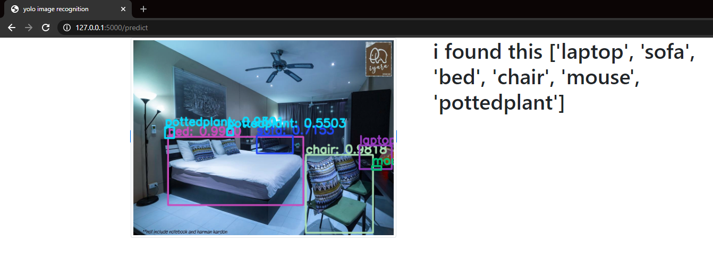

# yolo-flask-object-detection

<h2>disclaimer</h2>

download yolov3.weights fom net then decompress folders data and cfg

yolo code from : https://www.youtube.com/watch?v=_UqmgHKdntU&t=149s&ab_channel=TheAIGuy

demonstration : https://youtu.be/A4yjX0H-_KA

<h2>amelioration</h2>
<ul>
  <li>yolo avec flask </li>
  <li> responsive voice</li> 
</ul>
<h2>screenshots</h2>

